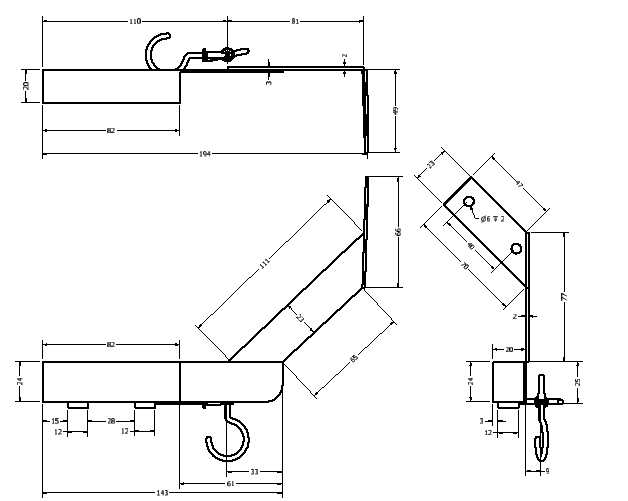

# Robótica- Proyecto Final

El siguiente informe muestra el desarrollo de un sistema robotizado para la automatización del proceso de Pick & Place y alistamiento de pedidos.

> ## Integrantes
> 
> - [Paula Sofía Medina Diaz](https://github.com/psmedinadi22) (psmedinadi@unal.edu.co)
> - Robinson Jair Orduxz Gomez (rjorduzg@unal.edu.co)

Desarrollo de herramienta multi-proposito
-------
Se debe diseño, construyó e instaló una herramienta personalizada que con varias ventosas para el proceso  de Pick & Place. Esto se realizó partiendo de las especificaciones del producto del manipulador IRB 140, especificamente de las dimensiones de la brida para herramientas y las cuales se pueden ver a continuación

<p align="center"></p>

A partir de las dimensiones de las ventosas y acoples dispuestos en el laboratorio y de la brida para herramientas del manipulador IRB 140 se diseño el porta ventosa tal que se adaptase a cada uno de estos elementos. Los archivos de fabricación se pueden ver en la carpeta de Models.

Código RAPID
-----------------------
EL código implementado se encuentra en la carpeta RAPID, a continuación se realiza una breve descripción de las secciones principales del código.

## Main

```
    PROC main()
        WaitDI DI_01,1;   !Espera entrada activación digital 
        Ensamble1;        !Empieza rutina de peak and place
    ENDPROC
    PROC Ensamble1()
        Path_home;        !Va a la posicion de home
        Path_Pick2;       !Recoge pieza
        Path_Place2;      !Coloca pieza
        Path_Pick1;
        Path_Place1;
        Path_Pick3;
        Path_Place3;
        Path_Pick4;
        Path_Place4;
        Path_Pick5;
        Path_Place5;
        Path_home;        !Va a la posicion de home
    ENDPROC
```

## Pick

```
    PROC Path_Pick1()
        MoveJ Target_30,v200,z0,T_ventosa\WObj:=WO_Peak;   !movimiento articular para de posicionamiento
        MoveL Target_20,v200,z0,T_ventosa\WObj:=WO_Peak;   !movimiento lineal para acercamiento
        MoveL Target_10,v200,z0,T_ventosa\WObj:=WO_Peak;   !movimiento lineal cooredenadas de la pieza
        WaitTime 1;                                        !espera de 1s
        SetDO DO_02,0;                                     !desactiva señal para soltar
        SetDO DO_01,1;                                     !activa señal para succiónar
        WaitTime 1;                                        !espera de 1s
        MoveL Target_20,v200,z0,T_ventosa\WObj:=WO_Peak;   !movimiento lineal intermedio para alejarse
        MoveL Target_30,v200,z0,T_ventosa\WObj:=WO_Peak;   !movimiento lineal final 
   ENDPROC
```

## Place

```
 PROC Path_Place1()
        MoveL Target_60,v200,z0,T_ventosa\WObj:=WO_Place;   !movimiento articular para de posicionamiento
        MoveL Target_50,v200,z0,T_ventosa\WObj:=WO_Place;   !movimiento lineal para acercamiento
        MoveL Target_40,v200,z0,T_ventosa\WObj:=WO_Place;   !movimiento lineal cooredenadas de la pieza
        WaitTime 1;                                         !espera de 1s
        SetDO DO_01,0;                                      !desactiva señal para succiónar
        SetDO DO_02,1;                                      !activa señal para soltar
        WaitTime 1;                                         !espera de 1s
        MoveL Target_50,v200,z0,T_ventosa\WObj:=WO_Place;   !movimiento lineal intermedio para alejarse
        MoveL Target_60,v200,z0,T_ventosa\WObj:=WO_Place;   !movimiento lineal final 
    ENDPROC
```

Rutina Pick and Place en RobotStudio
-----

Con los espacios de trabajo ubicados, se empieza aproximando el robot mediante desplazamientos articulares a cada posición de pick para evitar que la muñeca realice movimiento singulares, esta orientación se replica en el espacio de trabajo del place y mediante rotaciones alrededor del eje z se cambia la orientación de algunas piezas como se evidencia en el siguiente video. Cabe resaltar que para esta rutina se utilizo un z igual a 0 pues se requería precisión en la rutina, ademas se usó una velocidad de 200 mm/s y una aproximación al espacio de trabajo de place de 30 mm de modo que se garantice que ninguna pieza toque los tornillos de ensamble del gripper. En cuanto a las señales para activar y desactivar la ventosa, se crearon 2 salidas digitales DO_01 y DO_02 y se incorporaron en la trayectoria de cada pieza; asi mismo se agrego la entrada digital DI_01 para iniciar la rutina al presionar un botón en el tablero decontrol y se garantiza inicie y termine en la posición de home.


https://github.com/psmedinadi22/Robotica-Proyecto-Final/assets/64180738/14d0e0d4-9b5f-43a9-8223-c6ba8695b600


https://github.com/psmedinadi22/Robotica-Proyecto-Final/assets/64180738/a5c007e5-a015-45fd-8f0b-f71c1b167a31


https://github.com/psmedinadi22/Robotica-Proyecto-Final/assets/64180738/22546b57-1176-4821-b877-ec6715cfeffd


Resultados
----

Para el desarrollo de este proyecto se inició verificando la conexión neumática de la ventosa, seguido fue necesario verificar el voltaje de alimentación de la ventosa e identificar con una fuente de alimentación la conexión que activa y desactiva el sistema. Como la ventosa funciona a 24V permite la conexión directa al módulo de entradas y salidas, no obstante fue necesario verificar el cableado para confirmar la tierra y la ubicación de entradas y salidas predefinidas en el controlador DI_01 DO_01 y DO_02.

---
# Conclusiones
- Al momento de diseñar un proceso de ensamble, manufactura o de cualquier indole industrial es preciso tener en cuenta cuales son los requisitos y limitaciones tanto de espacio, dispositivo como a tareas a realizar, pues son estas las que definirán los diseños desde herramientas hasta los procesos mismos.

- Para la rutina desarrollada y el peso de cada pieza se evidenció que es posible optimizar la trayectoria, particularmente la velocidad de desplazamiento de entre los espacios de trabajo reduciendo el tiempo de ensamble del mecanismo.

- Para aplicaciones de pick and place es indispensable definir adecuadamente la orientación de los targets pues en este tipo de rutinas la precisión resulta muy importante a la hora ensamblar partes. También es importante resaltar que al realizar rutinas de pick la ventosa no debe acercarse y tocar la pieza de forma abrupta pues puede desplazar la pieza a sujetar y llegado el caso también piezas aledañas a esta, por tanto para este ejercicio se tomo un espacio entre la ventosa y el ensamble de un centímetro para que la ventosa se acercase.

- Si bien crear los espacios de pick and place de manera separada hace que en entornos industriales los procesos sean mas versátiles y flexibles al tener la capacidad y posibilidad de mover las diferentes estaciones a conveniencia, para este ejercicio académico haber tenido los espacios de pick and place en una sola estación hubiera facilitado el proceso al disminuir un proceso de calibración de un workspace extra.

- De cara a evitar singularidades es importante evitar en la mayor medida trayectorias que impliquen desplazamientos lineales que produzcan movimientos considerables en las articulaciones, y para esto se debe hacer una correcta planeación que va desde la disposición y orientación de cada uno de los elementos a ensamblar hasta la misma ubicación de las estaciones de trabajo.


---
# Referencias

- Ramírez, R. y Rodríguez, J. (2022). Guías de Robot Studio. Universidad Nacional de Colombia.
- Cárdenas, P. y Ramírez, R. (2020). Robótica - Proyecto Final. Universidad Nacional de Colombia.
- Spong, M. Hutchinson, S. y Vidyasagar, M. (2006). Robot modeling and control. John Wiley & Sons, Inc
- Apuntes de clase, Robótica 2023-1

---
